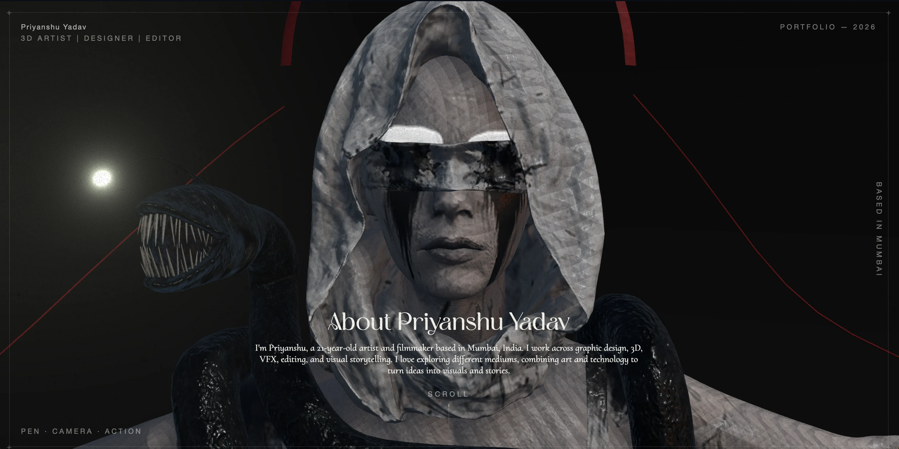

# 3D Portfolio Website

> An interactive 3D portfolio designed and developed as a custom digital experience for a client.

## ✦ Overview

A custom **3D portfolio website** built with **React Three Fiber, Three.js, TypeScript, and Vite**.

The website combines a **scroll-driven 3D environment** with interactive portfolio sections, project pages, animations, and visual effects to create an immersive way of presenting the client's creative work.

The 3D character and environment used in the website were **created by the client**, while the website experience was developed and customized around their work and visual identity.

## ✦ Features

- Scroll-driven 3D camera movement
- Custom 3D character and environment
- Interactive portfolio and resume sections
- Project gallery and detail pages
- Markdown-based project content
- Custom animations and transitions
- Depth of field, bloom, and film-grain effects
- Responsive HTML content layered over the 3D scene
- GitHub Pages deployment

## ✦ Credits & Attribution

The website was built using the open-source **3D Resume** project by **Sen Zheng (SEN / SenBuzy)** as its initial foundation.

[Original Project — Sen · 3D Resume](https://github.com/dayinji/sen-3d-resume)

The original project was extensively **modified, redesigned, and customized** for this client project.

## ✦ 3D Model

The **3D character and environment were created by the client** and form the visual foundation of the portfolio experience.

More of the client's creative work can be found here:

## Priyanshu Yadav
- [ArtStation](https://www.artstation.com/priyanshuyadav)
- [Youtube](https://www.youtube.com/@priyanshugonewild)
- [Instagram](https://www.instagram.com/priyanshugonewild)
- [LinkedIn](https://www.linkedin.com/in/priyanshu-yadav-16043424a?utm_source=share_via&utm_content=profile&utm_medium=member_android)

---

### 🛠 Tech Stack

**React 18 · TypeScript · React Three Fiber · Three.js · Drei · Framer Motion · Zustand · Vite · Markdown**

---

  Designed and developed as a custom 3D portfolio experience.

