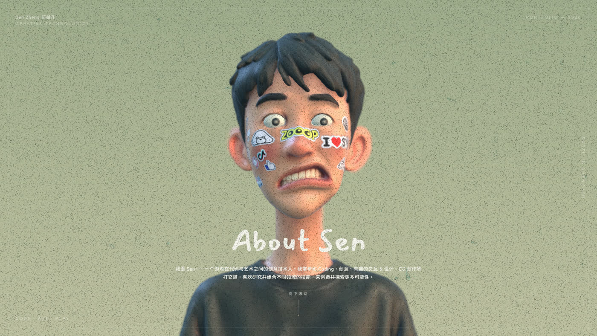

# 3D Portfolio Website

> An interactive 3D portfolio built to turn a traditional resume into an immersive visual experience.



## ✦ Overview

This is my personal **3D portfolio website**, built with **React Three Fiber, Three.js, TypeScript, and Vite**.

Instead of presenting my work through a conventional portfolio layout, the website combines a **scroll-driven 3D environment** with HTML-based portfolio sections, project pages, animations, and interactive visual elements.

The project started from an open-source 3D resume and was extensively **edited, redesigned, and customized** to create a portfolio that reflects my own work, visual style, projects, and creative direction.

---

## ✦ What’s Inside

- Scroll-driven 3D camera movement
- Custom 3D character and environment
- Interactive resume and portfolio sections
- Project gallery with dedicated detail pages
- Markdown-based project documentation
- Custom images, videos, models, and textures
- Animated transitions and UI interactions
- Depth of field, bloom, film grain, and other post-processing effects
- Responsive HTML content layered over the 3D scene
- GitHub Pages deployment

The project is structured so that **new portfolio work can be added through Markdown content and project data without rebuilding the entire experience.**

---

## ✦ Credits & Attribution

This project is based on the open-source 3D resume created by **Sen Zheng (SEN / SenBuzy)**.

**Original Project:**  
[Sen · 3D Resume](https://github.com/dayinji/sen-3d-resume)

The original project was used as a foundation and subsequently **modified, redesigned, and adapted** for my personal portfolio.

The 3D presentation, personal content, project information, media, UI elements, portfolio structure, and other customizations in this version were developed specifically for my work.

---

## 🛠 Tech Stack

| Technology | Purpose |
|---|---|
| **React 18** | UI and application structure |
| **TypeScript** | Type-safe development |
| **React Three Fiber** | React-based 3D rendering |
| **Three.js** | 3D graphics and scene management |
| **@react-three/drei** | Three.js helpers and utilities |
| **@react-three/postprocessing** | Visual effects and post-processing |
| **Framer Motion** | UI animations and transitions |
| **Zustand** | Application state management |
| **Vite** | Development and build tooling |
| **Markdown** | Project content management |

---

## 📂 Project Structure

```text
portfolio/
│
├── web/
│   ├── src/
│   │   ├── App.tsx
│   │   ├── main.tsx
│   │   ├── store.ts
│   │   │
│   │   ├── data/
│   │   │   ├── works.ts
│   │   │   ├── workDocs.ts
│   │   │   └── focusPoints.ts
│   │   │
│   │   ├── content/
│   │   │   └── works/
│   │   │       └── *.md
│   │   │
│   │   ├── scene/
│   │   │   ├── Scene.tsx
│   │   │   └── Env.tsx
│   │   │
│   │   └── ui/
│   │       ├── Resume.tsx
│   │       ├── Works.tsx
│   │       ├── LoadingScreen.tsx
│   │       └── ...
│   │
│   ├── public/
│   │   ├── models/
│   │   ├── images/
│   │   ├── textures/
│   │   ├── fonts/
│   │   └── works/
│   │
│   └── package.json
│
├── blender/
│   └── 3D source files
│
├── docs/
│   └── preview.jpg
│
├── .github/
│   └── workflows/
│       └── deploy.yml
│
├── LICENSE
└── README.md