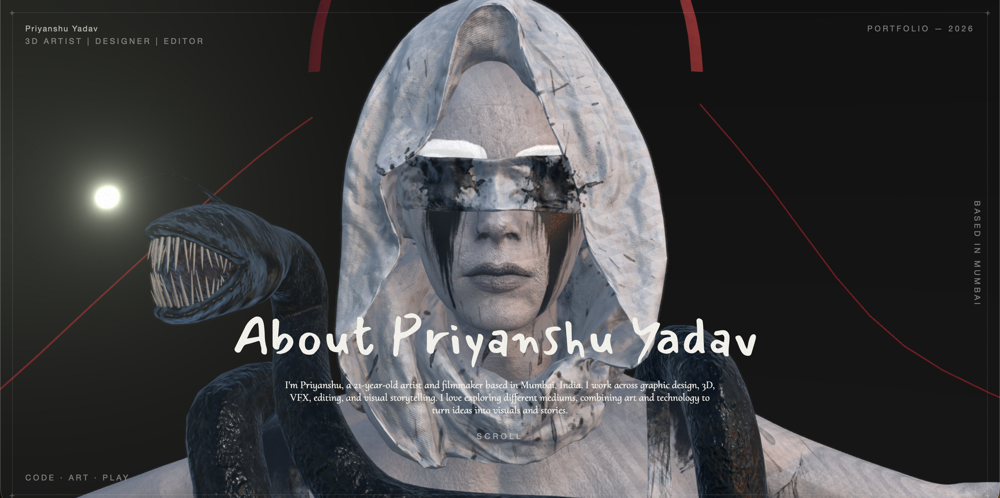

# 3D Portfolio Website

> An interactive 3D portfolio designed to transform a traditional portfolio into an immersive visual experience.



---

## ✦ Overview

This **3D portfolio website** was designed and developed as a custom portfolio experience for a client, combining **React Three Fiber, Three.js, TypeScript, and Vite**.

Rather than following a conventional portfolio layout, the website combines a **scroll-driven 3D environment** with interactive sections, project detail pages, animations, and layered HTML content.

The experience was customized around the client's **creative work, visual identity, projects, and content**, with the goal of creating a portfolio that feels more like an interactive digital space than a traditional website.

---

## ✦ Key Features

- Scroll-driven 3D camera movement
- Custom 3D character and environment
- Interactive portfolio and resume sections
- Project gallery with dedicated detail pages
- Markdown-based project content
- Custom images, videos, 3D models, and textures
- Animated UI transitions and interactions
- Depth of field, bloom, film grain, and other post-processing effects
- Responsive HTML content layered over the 3D scene
- GitHub Pages deployment

The content system was structured to make it easy to **add, update, and manage the client's projects** without changing the core 3D experience.

---

## ✦ Design & Development

The website was developed with a focus on combining **3D art, motion, interaction, and portfolio presentation** into a single experience.

The 3D environment serves as the visual foundation of the website, while HTML-based sections provide the portfolio information and project details.

The camera movement, UI transitions, visual effects, project layouts, and content presentation were customized to create a cohesive experience around the client's creative profile.

---

## ✦ Credits & Attribution

This project uses the open-source **3D resume project created by Sen Zheng (SEN / SenBuzy)** as its foundation.

**Original Project:**  
[Sen · 3D Resume](https://github.com/dayinji/sen-3d-resume)

The original project was **extensively modified, redesigned, and adapted** for this client project.

The implementation includes customized **3D presentation, portfolio structure, UI components, animations, content system, project pages, media, visual styling, and other client-specific modifications**.

---

## 🛠 Tech Stack

| Technology | Purpose |
|---|---|
| **React 18** | UI and application structure |
| **TypeScript** | Type-safe development |
| **React Three Fiber** | React-based 3D rendering |
| **Three.js** | 3D graphics and scene management |
| **@react-three/drei** | Three.js utilities and helpers |
| **@react-three/postprocessing** | Visual effects and post-processing |
| **Framer Motion** | UI animations and transitions |
| **Zustand** | State management |
| **Vite** | Development and build tooling |
| **Markdown** | Project content management |

---

## ✦ The Experience

The website is built around a **scroll-driven 3D experience** where the camera moves through different points of the environment as the user navigates through the portfolio.

The 3D scene and HTML interface work together to create a layered experience combining:

**3D Environment · Motion · Interaction · Portfolio Content**

This approach allows the client's work to be presented through both **visual storytelling and structured project information**, rather than relying solely on a traditional grid-based portfolio.

---

## ✦ Development

Clone the repository and move into the web project:

```bash
git clone <repository-url>
cd portfolio/web